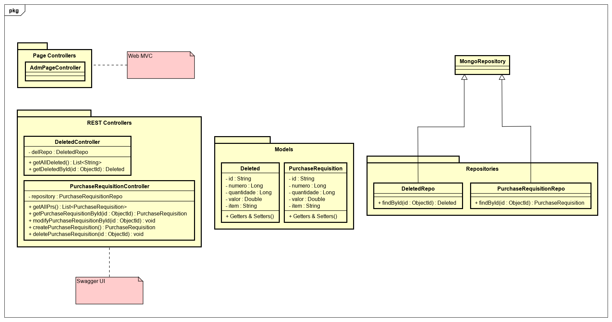

# Purchase Requisitions

O objetivo deste desafio é desenvolver um serviço web para operações CRUD com uma estrutura de dados que chamaremos de **requisição de compra** ou **purchase requisition**. Os registros devem ser disponibilizados para leitura numa interface web.

## Requisitos técnicos

### 1. Java com JDK mais recente
Foi escolhido o JDK 11.0.5, por ser a última versão com suporte a longo prazo.

### 2. Servidor voltado ao Java
Foi escolhido o Apache Tomcat, pela sua integração amigável com o *framework* Spring.

### 3. Banco de dados
Para o armazenamento dos dados em documentos JSON foi escolhido o NoSQL MongoDB, na nuvem Azure, no seu *tier* gratuito.

### 4. JRE local ou na nuvem
A aplicação está disponível na nuvem Heroku através dos seguintes links:

https://printegration.herokuapp.com/adm

https://printegration.herokuapp.com/swagger-ui.html

### 5. Framework
Foi escolhido o uso do Maven como gerenciador das dependências, associado ao *framework* Spring.

### 6. API REST com JSON
A gestão do serviço é facilitada pelo *framework* Spring.

## Requisitos funcionais

### 1. Formato JSON:
A coleção de documentos JSON contém os dados predeterminados com os seguintes campos:

```json
{
	"id": String,
	"numero": long,
	"quantidade": long,
	"valor": double,
	"item": String
}
```

### 2. Validações
As validações são gerenciadas pelo padrão REST oferecido pelo Spring.

### 3. Armazenamento
O armazenamento dos dados e as operações CRUD se dão através do *driver* para MongoDB oferecido pelo Spring.

### 4. Retorno (OK, não OK)
O retorno para o *client* segue o padrão REST oferecido pelo Spring.

### 5. Mostrar na tela ADM todas as ordens de compra.
Foi implementada uma *view* num arquivo ```jsp``` com o uso de JSTL e *Expression Language (EL)* para a listagem dos dados.

### 6. Exclusão de registro com inserção do registro excluído no sistema como arquivo XML
A cada exclusão da coleção de Requisições de Compra, uma inclusão é feita em outra coleção do banco de dados, e recuperada em XML.

### 7. Documentar com UML ou outros diagramas


### 8. Ponto extra: capacidade de 5K requisições por minuto
Escalabilidade a estudar.
